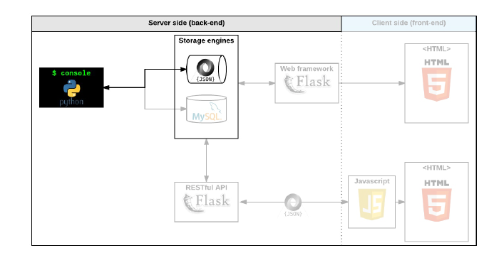

# AirBnB clone project


## Welcome to the AirBnB clone project!

# Table of Contents
- [Introduction](#introduction)
- [Features](#features)
- [Technologies Used](#technologies-used)
- [The console](#The-console)
- [Setup and Usage](#setup-and-usage)


# Introduction:
Welcome to the Airbnb Clone Project! This application is designed to
replicate the core functionalities of the popular accommodation booking platform,
Airbnb. The project aims to provide familiar and intuitive functionalities for:
- create a simple flow of serialization/deserialization: Instance <-> Dictionary <-> JSON string <-> file
- create all classes used for AirBnB (User, State, City, Place…) that inherit from BaseModel
- create the first abstracted storage engine of the project: File storage.
- create all unittests to validate all our classes and storage engine

This README is a guide through the features, technologies used, setup instructions, and more.

# Features

**Users(class)**: The following are to be used by the user:
           - show - ()
           - create - ()
           - destroy - ()
           - update
           - all - ()
**Console(command interpreter)**: Manages the objects of User class.
- Create a new object (ex: a new User or a new Place)
- Retrieve an object from a file, a database etc…
- Do operations on objects (count, compute stats, etc…)
- Update attributes of an object
- Destroy an object

# Technologies Used
- **Frontend**: (html, css)
- **Backend**: Python
- **Database**: File Storage, MySQL
- **Version Control**: Git, GitHub
- Here is the flow of the backend.

  


# The console
The console is a command-line interpreter that allows users to manage and manipulate instances of various classes in an application. The primary purpose of this script is to provide a way to interact with and manipulate objects by executing specific commands. The script operates within a command loop, where users can enter commands to create, retrieve, update, and delete instances of different classes.


# Setup and Usage
The command interpreter supports a variety of operations for managing objects within the application. It enables users to interact with the data model in a structured way. Below are the key operations that can be performed using this command interpreter:
* Create: Create a new instance of a specified class.
* Show: Retrieve and display information about a specific instance based on its class and ID.
* Destroy: Delete a specific instance based on its class and ID.
* All: Display information about all instances or instances of a specific class.
* Update: Update attributes of a specific instance based on its class and ID.
* Count: Count the number of instances of a specific class.
* Quit/Exit: Terminate the command interpreter.

## Setup

Setting up an Airbnb console involves preparing the environment, importing necessary modules,
and then interacting with the classes and methods you've implemented in your project. Here's a step-by-step
guide along with clear examples:

Open a terminal on your system and clone the repo.
```
$ git clone https://github.com/Fitsum-Kebede/AirBnB_clone.git
```
Use the cd command to navigate to the root directory of your Airbnb project.
```
$ cd AirBnB_clone
```
## Usage

Run the console to manage instances
```
$ ./console.py
(hbnb)help

Documented commands (type help <topic>):
========================================
EOF  all  count  create  destroy  help  quit  show  update

(hbnb)
```
The following are classes and operation that be performed on the classes using the console.
### classes
- BaseModel
- User
- State
- City
- Amenity
- Place
- Review
### console commands
- create
- show
- destroy
- all
- update
- count

# create
Creates a new instance of a class, saves it (to the JSON file) and prints the id
```
(hbnb) create BaseModel
b65f6cd1-b671-4367-be06-43a02c3bc858
(hbnb) create User
d007cb77-50ed-4ae0-bfbe-68d6246c65b3
(hbnb) create State
1d8f655d-4aef-44f7-ab55-d4bd59918708
(hbnb) create City
dd02d053-3500-4156-b4eb-b7223cc40ec3
(hbnb) create Amenity
a63bc346-24fe-4cde-99ca-a608eb862811
(hbnb) create Place
6c94d8c2-07f4-4de5-905d-a3b988fe06e3
(hbnb) create Review
3eec0a79-415e-47bf-906d-e1a8594daae8
(hbnb) all
["[BaseModel] (b65f6cd1-b671-4367-be06-43a02c3bc858) {'id': 'b65f6cd1-b671-4367-be06-43a02c3bc858', 'created_at': datetime.datetime(2023, 8, 14, 4, 33, 39, 418067), 'updated_at': datetime.datetime(2023, 8, 14, 4, 33, 39, 418116)}", "[User] (d007cb77-50ed-4ae0-bfbe-68d6246c65b3) {'id': 'd007cb77-50ed-4ae0-bfbe-68d6246c65b3', 'created_at': datetime.datetime(2023, 8, 14, 4, 33, 50, 79387), 'updated_at': datetime.datetime(2023, 8, 14, 4, 33, 50, 79439)}", "[State] (1d8f655d-4aef-44f7-ab55-d4bd59918708) {'id': '1d8f655d-4aef-44f7-ab55-d4bd59918708', 'created_at': datetime.datetime(2023, 8, 14, 4, 34, 9, 219814), 'updated_at': datetime.datetime(2023, 8, 14, 4, 34, 9, 219875)}", "[City] (dd02d053-3500-4156-b4eb-b7223cc40ec3) {'id': 'dd02d053-3500-4156-b4eb-b7223cc40ec3', 'created_at': datetime.datetime(2023, 8, 14, 4, 34, 19, 255961), 'updated_at': datetime.datetime(2023, 8, 14, 4, 34, 19, 256009)}", "[Amenity] (a63bc346-24fe-4cde-99ca-a608eb862811) {'id': 'a63bc346-24fe-4cde-99ca-a608eb862811', 'created_at': datetime.datetime(2023, 8, 14, 4, 34, 30, 918674), 'updated_at': datetime.datetime(2023, 8, 14, 4, 34, 30, 918730)}", "[Place] (6c94d8c2-07f4-4de5-905d-a3b988fe06e3) {'id': '6c94d8c2-07f4-4de5-905d-a3b988fe06e3', 'created_at': datetime.datetime(2023, 8, 14, 4, 34, 43, 521618), 'updated_at': datetime.datetime(2023, 8, 14, 4, 34, 43, 521690)}", "[Review] (3eec0a79-415e-47bf-906d-e1a8594daae8) {'id': '3eec0a79-415e-47bf-906d-e1a8594daae8', 'created_at': datetime.datetime(2023, 8, 14, 4, 34, 50, 933325), 'updated_at': datetime.datetime(2023, 8, 14, 4, 34, 50, 933378)}"]
(hbnb)
```
# show
Prints the string representation of an instance based on the class name and id.
- It can either be used as **show \<class name\> \<id\>** or **\<class name\>.show(\<id\>)**.
- example:
```
(hbnb) show BaseModel b65f6cd1-b671-4367-be06-43a02c3bc858
[BaseModel] (b65f6cd1-b671-4367-be06-43a02c3bc858) {'id': 'b65f6cd1-b671-4367-be06-43a02c3bc858', 'created_at': datetime.datetime(2023, 8, 14, 4, 33, 39, 418067), 'updated_at': datetime.datetime(2023, 8, 14, 4, 33, 39, 418116)}
(hbnb) BaseModel.show("b65f6cd1-b671-4367-be06-43a02c3bc858")
[BaseModel] (b65f6cd1-b671-4367-be06-43a02c3bc858) {'id': 'b65f6cd1-b671-4367-be06-43a02c3bc858', 'created_at': datetime.datetime(2023, 8, 14, 4, 33, 39, 418067), 'updated_at': datetime.datetime(2023, 8, 14, 4, 33, 39, 418116)}
(hbnb) show User d007cb77-50ed-4ae0-bfbe-68d6246c65b3
[User] (d007cb77-50ed-4ae0-bfbe-68d6246c65b3) {'id': 'd007cb77-50ed-4ae0-bfbe-68d6246c65b3', 'created_at': datetime.datetime(2023, 8, 14, 4, 33, 50, 79387), 'updated_at': datetime.datetime(2023, 8, 14, 4, 33, 50, 79439)}
(hbnb) User.show("d007cb77-50ed-4ae0-bfbe-68d6246c65b3")
[User] (d007cb77-50ed-4ae0-bfbe-68d6246c65b3) {'id': 'd007cb77-50ed-4ae0-bfbe-68d6246c65b3', 'created_at': datetime.datetime(2023, 8, 14, 4, 33, 50, 79387), 'updated_at': datetime.datetime(2023, 8, 14, 4, 33, 50, 79439)}
(hbnb)
```
# destroy
Deletes an instance based on the class name and id (save the change into the JSON file).
- It can either be used as **destroy \<class name\> \<id\>** or **\<class name\>.destroy(\<id\>)**.
- example:
```
(hbnb) create User
ddf5d0ec-9100-45d8-abba-fb6b126f376f
(hbnb) create User
6e202fc2-4f80-4425-ae03-684726dda42f
(hbnb) create User
0eb1d258-b314-490e-aee3-a0f935e98814
(hbnb) create User
4b05a6ba-8670-40cf-9dfd-036a3257b2a6
(hbnb) create User
de05db82-07fc-47ce-953e-3be6a737d495
(hbnb) User.count()
6
(hbnb) destroy User ddf5d0ec-9100-45d8-abba-fb6b126f376f
(hbnb) User.count()
5
(hbnb) destroy User ddf5d0ec-9100-45d8-abba-fb6b126f376f
** no instance found **
(hbnb) destroy User 6e202fc2-4f80-4425-ae03-684726dda42f
(hbnb) destroy User 6e202fc2-4f80-4425-ae03-684726dda42f
** no instance found **
(hbnb) User.count()
4
(hbnb) User.destroy("0eb1d258-b314-490e-aee3-a0f935e98814")
(hbnb) User.destroy("0eb1d258-b314-490e-aee3-a0f935e98814")
** no instance found **
(hbnb) User.destroy("4b05a6ba-8670-40cf-9dfd-036a3257b2a6")
(hbnb) User.destroy("4b05a6ba-8670-40cf-9dfd-036a3257b2a6")
** no instance found **
(hbnb) 
```
# all
Prints all string representation of all instances based or not on the class name.
- It can either be used as **all \<class name\>** or **\<class name\>.all()**.
- example:
```
(hbnb) all
["[BaseModel] (b65f6cd1-b671-4367-be06-43a02c3bc858) {'id': 'b65f6cd1-b671-4367-be06-43a02c3bc858', 'created_at': datetime.datetime(2023, 8, 14, 4, 33, 39, 418067), 'updated_at': datetime.datetime(2023, 8, 14, 4, 33, 39, 418116)}", "[User] (d007cb77-50ed-4ae0-bfbe-68d6246c65b3) {'id': 'd007cb77-50ed-4ae0-bfbe-68d6246c65b3', 'created_at': datetime.datetime(2023, 8, 14, 4, 33, 50, 79387), 'updated_at': datetime.datetime(2023, 8, 14, 4, 33, 50, 79439)}", "[State] (1d8f655d-4aef-44f7-ab55-d4bd59918708) {'id': '1d8f655d-4aef-44f7-ab55-d4bd59918708', 'created_at': datetime.datetime(2023, 8, 14, 4, 34, 9, 219814), 'updated_at': datetime.datetime(2023, 8, 14, 4, 34, 9, 219875)}", "[City] (dd02d053-3500-4156-b4eb-b7223cc40ec3) {'id': 'dd02d053-3500-4156-b4eb-b7223cc40ec3', 'created_at': datetime.datetime(2023, 8, 14, 4, 34, 19, 255961), 'updated_at': datetime.datetime(2023, 8, 14, 4, 34, 19, 256009)}", "[Amenity] (a63bc346-24fe-4cde-99ca-a608eb862811) {'id': 'a63bc346-24fe-4cde-99ca-a608eb862811', 'created_at': datetime.datetime(2023, 8, 14, 4, 34, 30, 918674), 'updated_at': datetime.datetime(2023, 8, 14, 4, 34, 30, 918730)}", "[Place] (6c94d8c2-07f4-4de5-905d-a3b988fe06e3) {'id': '6c94d8c2-07f4-4de5-905d-a3b988fe06e3', 'created_at': datetime.datetime(2023, 8, 14, 4, 34, 43, 521618), 'updated_at': datetime.datetime(2023, 8, 14, 4, 34, 43, 521690)}", "[Review] (3eec0a79-415e-47bf-906d-e1a8594daae8) {'id': '3eec0a79-415e-47bf-906d-e1a8594daae8', 'created_at': datetime.datetime(2023, 8, 14, 4, 34, 50, 933325), 'updated_at': datetime.datetime(2023, 8, 14, 4, 34, 50, 933378)}", "[User] (de05db82-07fc-47ce-953e-3be6a737d495) {'id': 'de05db82-07fc-47ce-953e-3be6a737d495', 'created_at': datetime.datetime(2023, 8, 14, 4, 59, 31, 750874), 'updated_at': datetime.datetime(2023, 8, 14, 4, 59, 31, 750912)}", "[BaseModel] (0303920a-ea12-4c01-918f-1b2bdab6134a) {'id': '0303920a-ea12-4c01-918f-1b2bdab6134a', 'created_at': datetime.datetime(2023, 8, 14, 6, 3, 31, 868782), 'updated_at': datetime.datetime(2023, 8, 14, 6, 3, 31, 868832)}", "[User] (9cc32290-206a-48bc-911a-859e99e88144) {'id': '9cc32290-206a-48bc-911a-859e99e88144', 'created_at': datetime.datetime(2023, 8, 14, 6, 3, 41, 59256), 'updated_at': datetime.datetime(2023, 8, 14, 6, 3, 41, 59303)}", "[User] (eb2aa6c8-2a5b-4ab4-8867-74eb2537797c) {'id': 'eb2aa6c8-2a5b-4ab4-8867-74eb2537797c', 'created_at': datetime.datetime(2023, 8, 14, 6, 3, 46, 342921), 'updated_at': datetime.datetime(2023, 8, 14, 6, 3, 46, 342971)}", "[BaseModel] (334c327a-98de-4e29-b1fc-6525d8c810b5) {'id': '334c327a-98de-4e29-b1fc-6525d8c810b5', 'created_at': datetime.datetime(2023, 8, 14, 6, 3, 47, 901362), 'updated_at': datetime.datetime(2023, 8, 14, 6, 3, 47, 901414)}", "[City] (2f67131d-3c6b-46f2-990f-2ef5aee3c16a) {'id': '2f67131d-3c6b-46f2-990f-2ef5aee3c16a', 'created_at': datetime.datetime(2023, 8, 14, 6, 3, 55, 419630), 'updated_at': datetime.datetime(2023, 8, 14, 6, 3, 55, 419686)}", "[State] (c9e65ba9-5507-4a14-84e9-ef986371b121) {'id': 'c9e65ba9-5507-4a14-84e9-ef986371b121', 'created_at': datetime.datetime(2023, 8, 14, 6, 4, 4, 969376), 'updated_at': datetime.datetime(2023, 8, 14, 6, 4, 4, 969429)}", "[State] (b80d9d7c-fe90-428a-8084-34b0fb85a3db) {'id': 'b80d9d7c-fe90-428a-8084-34b0fb85a3db', 'created_at': datetime.datetime(2023, 8, 14, 6, 4, 6, 240019), 'updated_at': datetime.datetime(2023, 8, 14, 6, 4, 6, 240070)}", "[City] (c5301f31-a93c-46a1-ad09-09ade63520f6) {'id': 'c5301f31-a93c-46a1-ad09-09ade63520f6', 'created_at': datetime.datetime(2023, 8, 14, 6, 4, 8, 129005), 'updated_at': datetime.datetime(2023, 8, 14, 6, 4, 8, 129033)}", "[Amenity] (c8ff1d26-37a7-4838-b46e-e1b0f175c65f) {'id': 'c8ff1d26-37a7-4838-b46e-e1b0f175c65f', 'created_at': datetime.datetime(2023, 8, 14, 6, 4, 35, 631521), 'updated_at': datetime.datetime(2023, 8, 14, 6, 4, 35, 631562)}", "[Amenity] (5fb81955-c1fe-45c0-823b-5c69bb97fe69) {'id': '5fb81955-c1fe-45c0-823b-5c69bb97fe69', 'created_at': datetime.datetime(2023, 8, 14, 6, 4, 37, 556652), 'updated_at': datetime.datetime(2023, 8, 14, 6, 4, 37, 556699)}", "[Amenity] (16b37058-de0c-439a-b15c-06021f2ff43b) {'id': '16b37058-de0c-439a-b15c-06021f2ff43b', 'created_at': datetime.datetime(2023, 8, 14, 6, 4, 38, 282016), 'updated_at': datetime.datetime(2023, 8, 14, 6, 4, 38, 282075)}", "[Place] (6c4d23a5-7dae-4651-a7e4-0f619a05b819) {'id': '6c4d23a5-7dae-4651-a7e4-0f619a05b819', 'created_at': datetime.datetime(2023, 8, 14, 6, 4, 59, 837114), 'updated_at': datetime.datetime(2023, 8, 14, 6, 4, 59, 837154)}", "[Place] (1bef1e30-43e0-4e5d-a711-c85161050978) {'id': '1bef1e30-43e0-4e5d-a711-c85161050978', 'created_at': datetime.datetime(2023, 8, 14, 6, 5, 0, 607447), 'updated_at': datetime.datetime(2023, 8, 14, 6, 5, 0, 607491)}", "[Place] (a53ffcf9-fc15-4a6d-ba2e-5ba79d148ee3) {'id': 'a53ffcf9-fc15-4a6d-ba2e-5ba79d148ee3', 'created_at': datetime.datetime(2023, 8, 14, 6, 5, 1, 430221), 'updated_at': datetime.datetime(2023, 8, 14, 6, 5, 1, 430263)}"]
(hbnb)
(hbnb) all BaseModel
["[BaseModel] (b65f6cd1-b671-4367-be06-43a02c3bc858) {'id': 'b65f6cd1-b671-4367-be06-43a02c3bc858', 'created_at': datetime.datetime(2023, 8, 14, 4, 33, 39, 418067), 'updated_at': datetime.datetime(2023, 8, 14, 4, 33, 39, 418116)}", "[BaseModel] (0303920a-ea12-4c01-918f-1b2bdab6134a) {'id': '0303920a-ea12-4c01-918f-1b2bdab6134a', 'created_at': datetime.datetime(2023, 8, 14, 6, 3, 31, 868782), 'updated_at': datetime.datetime(2023, 8, 14, 6, 3, 31, 868832)}", "[BaseModel] (334c327a-98de-4e29-b1fc-6525d8c810b5) {'id': '334c327a-98de-4e29-b1fc-6525d8c810b5', 'created_at': datetime.datetime(2023, 8, 14, 6, 3, 47, 901362), 'updated_at': datetime.datetime(2023, 8, 14, 6, 3, 47, 901414)}"]
(hbnb)
(hbnb) BaseModel.all()
["[BaseModel] (b65f6cd1-b671-4367-be06-43a02c3bc858) {'id': 'b65f6cd1-b671-4367-be06-43a02c3bc858', 'created_at': datetime.datetime(2023, 8, 14, 4, 33, 39, 418067), 'updated_at': datetime.datetime(2023, 8, 14, 4, 33, 39, 418116)}", "[BaseModel] (0303920a-ea12-4c01-918f-1b2bdab6134a) {'id': '0303920a-ea12-4c01-918f-1b2bdab6134a', 'created_at': datetime.datetime(2023, 8, 14, 6, 3, 31, 868782), 'updated_at': datetime.datetime(2023, 8, 14, 6, 3, 31, 868832)}", "[BaseModel] (334c327a-98de-4e29-b1fc-6525d8c810b5) {'id': '334c327a-98de-4e29-b1fc-6525d8c810b5', 'created_at': datetime.datetime(2023, 8, 14, 6, 3, 47, 901362), 'updated_at': datetime.datetime(2023, 8, 14, 6, 3, 47, 901414)}"]
(hbnb)
(hbnb) all User
["[User] (d007cb77-50ed-4ae0-bfbe-68d6246c65b3) {'id': 'd007cb77-50ed-4ae0-bfbe-68d6246c65b3', 'created_at': datetime.datetime(2023, 8, 14, 4, 33, 50, 79387), 'updated_at': datetime.datetime(2023, 8, 14, 4, 33, 50, 79439)}", "[User] (de05db82-07fc-47ce-953e-3be6a737d495) {'id': 'de05db82-07fc-47ce-953e-3be6a737d495', 'created_at': datetime.datetime(2023, 8, 14, 4, 59, 31, 750874), 'updated_at': datetime.datetime(2023, 8, 14, 4, 59, 31, 750912)}", "[User] (9cc32290-206a-48bc-911a-859e99e88144) {'id': '9cc32290-206a-48bc-911a-859e99e88144', 'created_at': datetime.datetime(2023, 8, 14, 6, 3, 41, 59256), 'updated_at': datetime.datetime(2023, 8, 14, 6, 3, 41, 59303)}", "[User] (eb2aa6c8-2a5b-4ab4-8867-74eb2537797c) {'id': 'eb2aa6c8-2a5b-4ab4-8867-74eb2537797c', 'created_at': datetime.datetime(2023, 8, 14, 6, 3, 46, 342921), 'updated_at': datetime.datetime(2023, 8, 14, 6, 3, 46, 342971)}"]
(hbnb)
(hbnb) User.all()
["[User] (d007cb77-50ed-4ae0-bfbe-68d6246c65b3) {'id': 'd007cb77-50ed-4ae0-bfbe-68d6246c65b3', 'created_at': datetime.datetime(2023, 8, 14, 4, 33, 50, 79387), 'updated_at': datetime.datetime(2023, 8, 14, 4, 33, 50, 79439)}", "[User] (de05db82-07fc-47ce-953e-3be6a737d495) {'id': 'de05db82-07fc-47ce-953e-3be6a737d495', 'created_at': datetime.datetime(2023, 8, 14, 4, 59, 31, 750874), 'updated_at': datetime.datetime(2023, 8, 14, 4, 59, 31, 750912)}", "[User] (9cc32290-206a-48bc-911a-859e99e88144) {'id': '9cc32290-206a-48bc-911a-859e99e88144', 'created_at': datetime.datetime(2023, 8, 14, 6, 3, 41, 59256), 'updated_at': datetime.datetime(2023, 8, 14, 6, 3, 41, 59303)}", "[User] (eb2aa6c8-2a5b-4ab4-8867-74eb2537797c) {'id': 'eb2aa6c8-2a5b-4ab4-8867-74eb2537797c', 'created_at': datetime.datetime(2023, 8, 14, 6, 3, 46, 342921), 'updated_at': datetime.datetime(2023, 8, 14, 6, 3, 46, 342971)}"]
(hbnb)
(hbnb) all Place
["[Place] (6c94d8c2-07f4-4de5-905d-a3b988fe06e3) {'id': '6c94d8c2-07f4-4de5-905d-a3b988fe06e3', 'created_at': datetime.datetime(2023, 8, 14, 4, 34, 43, 521618), 'updated_at': datetime.datetime(2023, 8, 14, 4, 34, 43, 521690)}", "[Place] (6c4d23a5-7dae-4651-a7e4-0f619a05b819) {'id': '6c4d23a5-7dae-4651-a7e4-0f619a05b819', 'created_at': datetime.datetime(2023, 8, 14, 6, 4, 59, 837114), 'updated_at': datetime.datetime(2023, 8, 14, 6, 4, 59, 837154)}", "[Place] (1bef1e30-43e0-4e5d-a711-c85161050978) {'id': '1bef1e30-43e0-4e5d-a711-c85161050978', 'created_at': datetime.datetime(2023, 8, 14, 6, 5, 0, 607447), 'updated_at': datetime.datetime(2023, 8, 14, 6, 5, 0, 607491)}", "[Place] (a53ffcf9-fc15-4a6d-ba2e-5ba79d148ee3) {'id': 'a53ffcf9-fc15-4a6d-ba2e-5ba79d148ee3', 'created_at': datetime.datetime(2023, 8, 14, 6, 5, 1, 430221), 'updated_at': datetime.datetime(2023, 8, 14, 6, 5, 1, 430263)}"]
(hbnb)
(hbnb) Place.all()
["[Place] (6c94d8c2-07f4-4de5-905d-a3b988fe06e3) {'id': '6c94d8c2-07f4-4de5-905d-a3b988fe06e3', 'created_at': datetime.datetime(2023, 8, 14, 4, 34, 43, 521618), 'updated_at': datetime.datetime(2023, 8, 14, 4, 34, 43, 521690)}", "[Place] (6c4d23a5-7dae-4651-a7e4-0f619a05b819) {'id': '6c4d23a5-7dae-4651-a7e4-0f619a05b819', 'created_at': datetime.datetime(2023, 8, 14, 6, 4, 59, 837114), 'updated_at': datetime.datetime(2023, 8, 14, 6, 4, 59, 837154)}", "[Place] (1bef1e30-43e0-4e5d-a711-c85161050978) {'id': '1bef1e30-43e0-4e5d-a711-c85161050978', 'created_at': datetime.datetime(2023, 8, 14, 6, 5, 0, 607447), 'updated_at': datetime.datetime(2023, 8, 14, 6, 5, 0, 607491)}", "[Place] (a53ffcf9-fc15-4a6d-ba2e-5ba79d148ee3) {'id': 'a53ffcf9-fc15-4a6d-ba2e-5ba79d148ee3', 'created_at': datetime.datetime(2023, 8, 14, 6, 5, 1, 430221), 'updated_at': datetime.datetime(2023, 8, 14, 6, 5, 1, 430263)}"]
(hbnb) 
```
# update
Updates an instance based on the class name and id by adding or updating attribute (save the change into the JSON file).
- Usage: **update \<class name\> \<id\> \<attribute name\> "\<attribute value\>"**
- Usage: **\<class name\>.update(\<id\>, \<dictionary representation\>)**.
```
(hbnb) User.all()
["[User] (d007cb77-50ed-4ae0-bfbe-68d6246c65b3) {'id': 'd007cb77-50ed-4ae0-bfbe-68d6246c65b3', 'created_at': datetime.datetime(2023, 8, 14, 4, 33, 50, 79387), 'updated_at': datetime.datetime(2023, 8, 14, 4, 33, 50, 79439)}", "[User] (de05db82-07fc-47ce-953e-3be6a737d495) {'id': 'de05db82-07fc-47ce-953e-3be6a737d495', 'created_at': datetime.datetime(2023, 8, 14, 4, 59, 31, 750874), 'updated_at': datetime.datetime(2023, 8, 14, 4, 59, 31, 750912)}", "[User] (9cc32290-206a-48bc-911a-859e99e88144) {'id': '9cc32290-206a-48bc-911a-859e99e88144', 'created_at': datetime.datetime(2023, 8, 14, 6, 3, 41, 59256), 'updated_at': datetime.datetime(2023, 8, 14, 6, 3, 41, 59303)}", "[User] (eb2aa6c8-2a5b-4ab4-8867-74eb2537797c) {'id': 'eb2aa6c8-2a5b-4ab4-8867-74eb2537797c', 'created_at': datetime.datetime(2023, 8, 14, 6, 3, 46, 342921), 'updated_at': datetime.datetime(2023, 8, 14, 6, 3, 46, 342971)}"]
(hbnb) update User d007cb77-50ed-4ae0-bfbe-68d6246c65b3 email "example_email@airbnb_clone.com"
(hbnb)
(hbnb) User.show("d007cb77-50ed-4ae0-bfbe-68d6246c65b3")
[User] (d007cb77-50ed-4ae0-bfbe-68d6246c65b3) {'id': 'd007cb77-50ed-4ae0-bfbe-68d6246c65b3', 'created_at': datetime.datetime(2023, 8, 14, 4, 33, 50, 79387), 'updated_at': datetime.datetime(2023, 8, 14, 7, 58, 55, 292470), 'email': 'example_email@airbnb_clone.com'}
(hbnb) 
(hbnb) User.update("d007cb77-50ed-4ae0-bfbe-68d6246c65b3", {"first_name": "console", "last_name": "airbnb_clone", "password": "project"})
(hbnb) 
(hbnb) User.show("d007cb77-50ed-4ae0-bfbe-68d6246c65b3")
[User] (d007cb77-50ed-4ae0-bfbe-68d6246c65b3) {'id': 'd007cb77-50ed-4ae0-bfbe-68d6246c65b3', 'created_at': datetime.datetime(2023, 8, 14, 4, 33, 50, 79387), 'updated_at': datetime.datetime(2023, 8, 14, 8, 3, 35, 908182), 'email': 'example_email@airbnb_clone.com', 'first_name': 'console', 'last_name': 'airbnb_clone', 'password': 'project'}
(hbnb) 
```
# count
Retrieve the number of instances of a class: <class name>.count()
```
(hbnb) User.count()
4
(hbnb) User.all()
["[User] (d007cb77-50ed-4ae0-bfbe-68d6246c65b3) {'id': 'd007cb77-50ed-4ae0-bfbe-68d6246c65b3', 'created_at': datetime.datetime(2023, 8, 14, 4, 33, 50, 79387), 'updated_at': datetime.datetime(2023, 8, 14, 8, 3, 35, 908182), 'email': 'example_email@airbnb_clone.com', 'first_name': 'console', 'l': 'a', 'password': 'project'}", "[User] (de05db82-07fc-47ce-953e-3be6a737d495) {'id': 'de05db82-07fc-47ce-953e-3be6a737d495', 'created_at': datetime.datetime(2023, 8, 14, 4, 59, 31, 750874), 'updated_at': datetime.datetime(2023, 8, 14, 4, 59, 31, 750912)}", "[User] (9cc32290-206a-48bc-911a-859e99e88144) {'id': '9cc32290-206a-48bc-911a-859e99e88144', 'created_at': datetime.datetime(2023, 8, 14, 6, 3, 41, 59256), 'updated_at': datetime.datetime(2023, 8, 14, 6, 3, 41, 59303)}", "[User] (eb2aa6c8-2a5b-4ab4-8867-74eb2537797c) {'id': 'eb2aa6c8-2a5b-4ab4-8867-74eb2537797c', 'created_at': datetime.datetime(2023, 8, 14, 6, 3, 46, 342921), 'updated_at': datetime.datetime(2023, 8, 14, 6, 3, 46, 342971)}"]
(hbnb) BaseModel.count()
3
(hbnb) BaseModel.all()
["[BaseModel] (b65f6cd1-b671-4367-be06-43a02c3bc858) {'id': 'b65f6cd1-b671-4367-be06-43a02c3bc858', 'created_at': datetime.datetime(2023, 8, 14, 4, 33, 39, 418067), 'updated_at': datetime.datetime(2023, 8, 14, 4, 33, 39, 418116)}", "[BaseModel] (0303920a-ea12-4c01-918f-1b2bdab6134a) {'id': '0303920a-ea12-4c01-918f-1b2bdab6134a', 'created_at': datetime.datetime(2023, 8, 14, 6, 3, 31, 868782), 'updated_at': datetime.datetime(2023, 8, 14, 6, 3, 31, 868832)}", "[BaseModel] (334c327a-98de-4e29-b1fc-6525d8c810b5) {'id': '334c327a-98de-4e29-b1fc-6525d8c810b5', 'created_at': datetime.datetime(2023, 8, 14, 6, 3, 47, 901362), 'updated_at': datetime.datetime(2023, 8, 14, 6, 3, 47, 901414)}"]
(hbnb) 
(hbnb) Amenity.count()
4
(hbnb) Amenity.all()
["[Amenity] (a63bc346-24fe-4cde-99ca-a608eb862811) {'id': 'a63bc346-24fe-4cde-99ca-a608eb862811', 'created_at': datetime.datetime(2023, 8, 14, 4, 34, 30, 918674), 'updated_at': datetime.datetime(2023, 8, 14, 4, 34, 30, 918730)}", "[Amenity] (c8ff1d26-37a7-4838-b46e-e1b0f175c65f) {'id': 'c8ff1d26-37a7-4838-b46e-e1b0f175c65f', 'created_at': datetime.datetime(2023, 8, 14, 6, 4, 35, 631521), 'updated_at': datetime.datetime(2023, 8, 14, 6, 4, 35, 631562)}", "[Amenity] (5fb81955-c1fe-45c0-823b-5c69bb97fe69) {'id': '5fb81955-c1fe-45c0-823b-5c69bb97fe69', 'created_at': datetime.datetime(2023, 8, 14, 6, 4, 37, 556652), 'updated_at': datetime.datetime(2023, 8, 14, 6, 4, 37, 556699)}", "[Amenity] (16b37058-de0c-439a-b15c-06021f2ff43b) {'id': '16b37058-de0c-439a-b15c-06021f2ff43b', 'created_at': datetime.datetime(2023, 8, 14, 6, 4, 38, 282016), 'updated_at': datetime.datetime(2023, 8, 14, 6, 4, 38, 282075)}"]
(hbnb) 
```

# contributors
- **Ezra Nobrega** <ezra.nobrega@outlook.com>
- **Justin Majetich** <justinmajetich@gmail.com>
- **Mcnores-Samuel** <samuelmcnores1@gmail.com>

